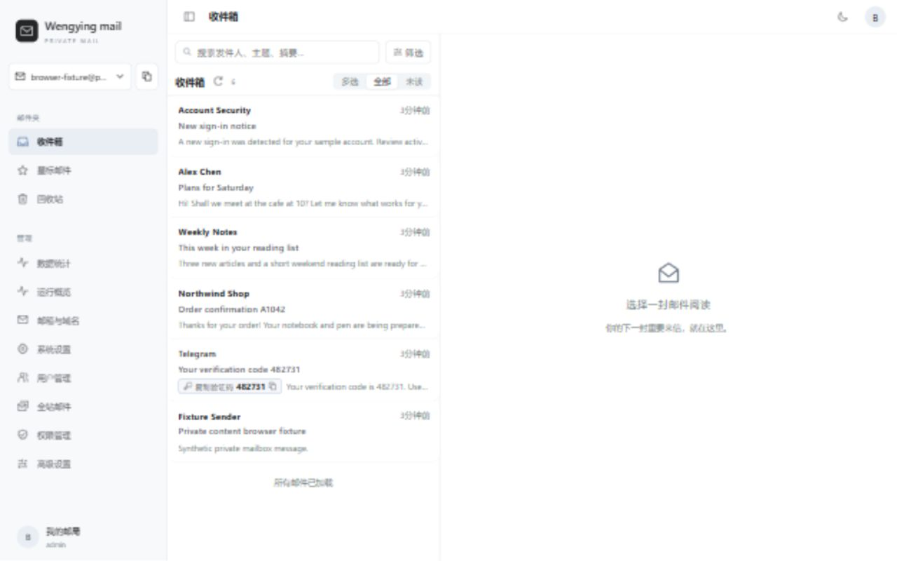
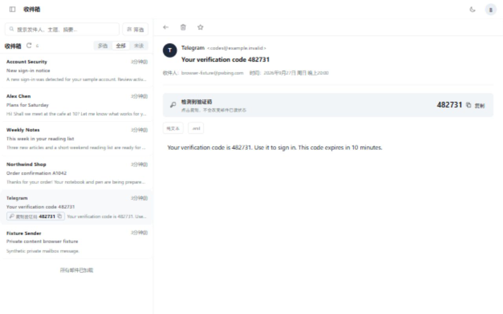
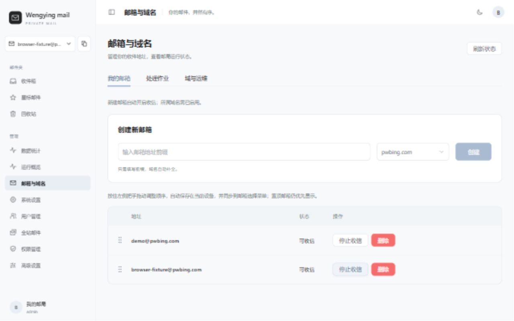
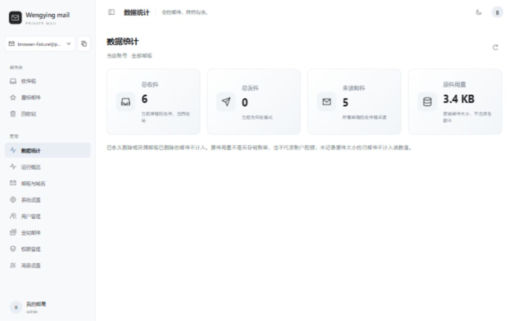
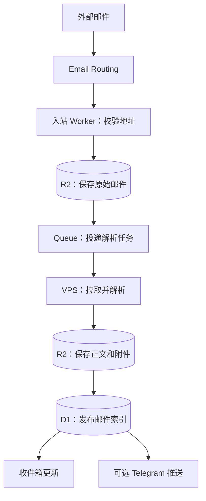
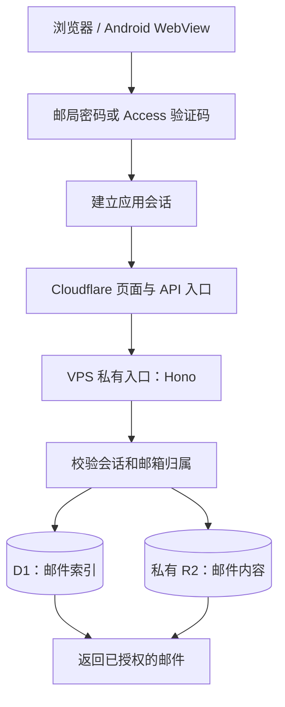

# Wenying mail

Wenying mail 是面向个人域名的只收邮件应用，基于 [ayingQAQ/cloud-mail](https://github.com/ayingQAQ/cloud-mail) 与原项目 [maillab/cloud-mail](https://github.com/maillab/cloud-mail) 改造。它将**邮件接收、原件保存、异步解析、收件箱查询**分开处理：入站时先保存原始邮件，再由队列处理正文和附件。项目不提供邮件发送或公开注册。

界面支持管理多个明确创建的收件地址、切换与排序邮箱、搜索、已读和星标、回收站、验证码识别与一键复制，以及移动端布局。Android 目录提供轻量 WebView 客户端。Telegram 机器人可选择要推送的邮箱，并提供 `/mailboxes` 和 `/test` 命令。

## 界面预览

以下画面使用本地生成的虚构邮箱和邮件，不含真实收件内容。点击图片可查看原图。

**收件箱**：同时展示验证码、订单、订阅、普通来信、安全提醒和附件邮件。

[](assets/screenshots/inbox.jpg)

**验证码邮件**：在列表和正文中直接显示复制入口。

[](assets/screenshots/verification.jpg)

**邮箱与域名**：创建收件地址并管理各邮箱的收信状态。

[](assets/screenshots/mailboxes.jpg)

**数据统计**：查看当前账号的收件、未读和原件用量。

[](assets/screenshots/statistics.jpg)

## 组件与职责

| 组件 | 实现 | 职责 |
| --- | --- | --- |
| 网页界面 | `mail-vue`：Vue 3、Vite、Pinia、Element Plus | 收件箱、邮件详情、邮箱管理和设置；通过受保护的 API 读取数据 |
| 入站入口 | `mail-worker/src/inbound`：Cloudflare Email Worker | 校验收件地址，把原始邮件与投递信息写入私有 R2；成功保存后才完成入站接收 |
| 页面与 API 入口 | `mail-worker/src/index.js`：Cloudflare Worker、Hono | 提供页面资源、登录入口，并将 API 请求转发到 VPS 或本地处理 |
| 后台处理 | `mail-worker/src/processing`、`src/vps`：队列、Node.js | 拉取待处理任务，解析 MIME、生成正文和附件、发布邮件索引、重试失败任务 |
| 持久化 | Cloudflare D1、私有 R2 | D1 保存邮箱、邮件索引和处理状态；R2 保存原始 EML、正文及附件对象 |
| 通知 | `mail-worker/src/service/telegram-notification.js`、`src/vps/telegram-bot.js` | 邮件发布后发送可选 Telegram 通知，按用户选择的邮箱过滤 |
| 手机客户端 | `android` | 使用系统 WebView 加载网页应用 |
| 备份工具 | `ops/backup` | 提供加密备份和隔离恢复工具，需另行配置、演练和启用 |

## 收信逻辑



1. **地址准入**：入站入口只接受已创建且允许收信的明确地址；未知地址直接拒绝。邮件大小也在入口校验。
2. **先存原件**：原始字节和投递信息写入 R2 后才向上游确认接收。入站唤醒只是加速信号，邮件本身不经唤醒接口传输。
3. **异步处理**：R2 对象通知进入队列，VPS 处理器拉取任务、解析 MIME，并把正文和附件写到私有 R2。D1 中的任务状态、租约和发布条件用于避免重复发布。
4. **可见与通知**：索引成功发布到 D1 后，收件箱收到更新事件；Telegram 推送按用户选中的邮箱过滤，通知失败不会撤销已发布邮件。
5. **故障处理**：失败任务按状态重试，异常事件可进入死信记录。原件与队列的核对恢复有独立开关，需在部署环境明确启用和验证；不能把它视作默认开启。

## 登录、读取与安全边界



登录支持独立邮局密码；配置对应模式后，也可通过 Cloudflare Access 的一次性验证码回调建立应用会话。Access 负责验证码回调的身份验证，应用 API 仍检查会话和邮箱归属。页面入口到 VPS 的转发使用独立的源站凭据；正文、附件和原始 EML 不作为公共静态资源暴露。已删除、停用或不属于当前用户的邮箱和邮件不会因知道对象地址而直接可读。

删除、恢复、过期清理和物理清除分属不同状态与任务，避免把用户界面上的移除误当作对象已经从 R2 物理删除。恢复扫描、删除清理、物理清除和旧版本垃圾回收均由部署开关控制，需要分别验证后启用。

## 代码入口

```text
mail-vue/                     Vue 页面、状态管理与前端构建
mail-worker/src/index.js      网页/API Worker 入口与计划任务开关
mail-worker/src/inbound/      收件地址校验、原件写入和即时唤醒
mail-worker/src/processing/   队列处理、发布、重试和恢复
mail-worker/src/service/      邮件读取、权限检查与通知
mail-worker/src/security/     登录、会话和只收信限制
mail-worker/src/vps/          VPS HTTP 服务、队列拉取与 Telegram Bot
android/                      Android WebView 客户端
ops/vps/                      VPS 服务与环境变量示例
ops/backup/                   备份及隔离恢复工具
```

## 本地构建与部署准备

需要 Node.js 24、pnpm 11。前端与 VPS 服务分别构建：

```sh
cd mail-vue
pnpm install --frozen-lockfile
pnpm build

cd ../mail-worker
pnpm install --frozen-lockfile
pnpm build:vps
```

Android 客户端还需要 Android SDK；发布签名应自行保管。构建成功不等于生产部署完成。部署前需创建自己的 Cloudflare Email Routing、Worker、Queue、D1、R2、域名及所需 Access 策略，配置 VPS、入口凭据和最小权限访问，并验证实际收信、失败重试和恢复行为。示例配置不能直接当作生产凭据使用。备份工具不会因部署应用而自动启用，本仓库不附带生产密钥或备份数据。

## 来源与许可

本项目基于上述上游源码改造，保留原项目的 [MIT License](LICENSE) 并注明来源。此公开仓库以独立历史发布。
